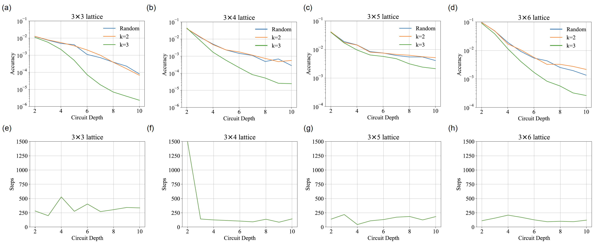

# LWPP initialization

This repository contains the implementation of Low-Weigth Pauli Propagation initialization, as described in our manuscript: [arXiv:2508.06358](https://arxiv.org/abs/2508.06358). Benchmarking this strategy on Heisenberg models, we demonstrate a remarkable enhancement in both the final accuracy and convergence rate.

# Installation

This work is based on the infrastructure by [TensorCircuit-NG](https://github.com/tensorcircuit/tensorcircuit-ng).